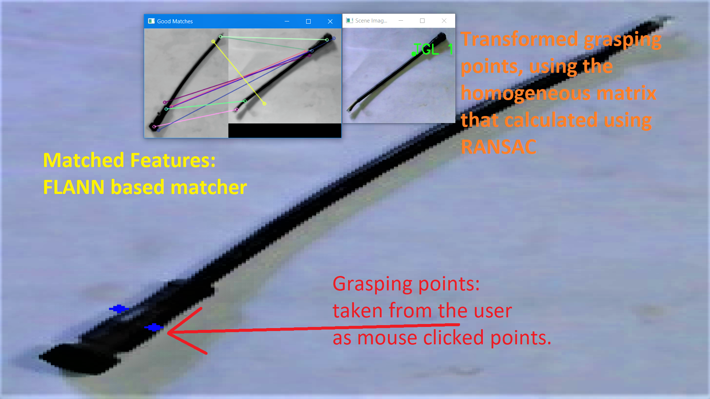

# Grasp-Detection 🌱

Detecting grasp point of an object by matching it with a template image using SIFT features

- Inspired by the paper : [***Grasp Detection under Occlusions Using SIFT Features***](https://www.hindawi.com/journals/complexity/2021/7619794/)
- Tested on:
    * *OpenCV version :  4.5.2*
    * *Numpy version :  1.20.2*

## RANSAC Algorithm performs poorly when there are large number of outliers

```
Homography Matrix :
 [[-1.52476214e+00 -1.04132676e+00  2.52647538e+02]
 [ 1.71652438e-01  1.28717451e-01 -3.49052204e+01]
 [-6.18710693e-03 -4.20617541e-03  1.00000000e+00]]
 
Transformed Grasp Locations :
 [[ 365.94464164 -138.84489806]
 [ 154.21146108   56.54208207]]
```



## Improve performance of the RANSAC

Using the method 1 explained in the following paper:

 * ***SIFT Feature Point Matching Based on Improved RANSAC Algorithm*** by Guangjun Shi, Xiangyang Xu, Yaping Dai

Method 2 explained in the paper is not implemented in this code. Because it is not possible to use the method 2 in our scenario where images may be rotated by a large angle. Therefore, cross points are a natural thing in our case.